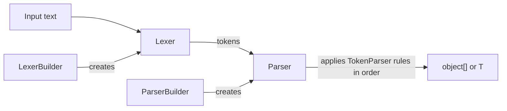

# Appy.Parsing: Architecture

## Overview

Appy.Parsing converts raw text into objects in two stages. A `Lexer` runs one combined regular
expression (one named group per `Tokenizer`) and turns each match into a token object; text that
matches nothing is kept as a string unless the lexer ignores it. A `Parser` then applies its
`TokenParser` rules in registration order. Each rule encodes the token sequence as a string of type
identifiers, matches its pattern against it and replaces the matched run with the object it
creates, repeating until the rule no longer matches.

`LexerBuilder` and `ParserBuilder` are the public entry points: fluent builders that declare the
grammar. Build and test guidance lives in [AGENTS.md](../AGENTS.md).

## System Diagram

## Key Patterns

### Builders define the grammar

`LexerBuilder.Match*` registers tokenizers (regex, enum values via `[Match]`, dictionaries).
`ParserBuilder.Match*` registers token rules with `MatchOptions` (`AllInOrder`, `AnyOrder`,
`AtLeastOne`) that expand into one rule per accepted token combination. Builders compose with
`CombineWith`.

### Cached tokenization

`Lexer` caches the token array per input expression in a `ConcurrentDictionary`, so repeated
expressions skip the regex pass.
